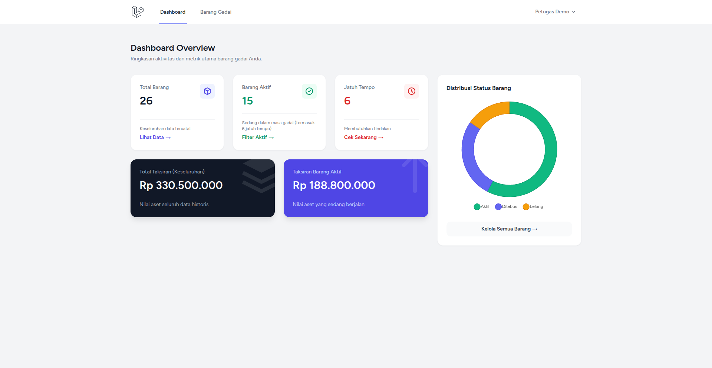
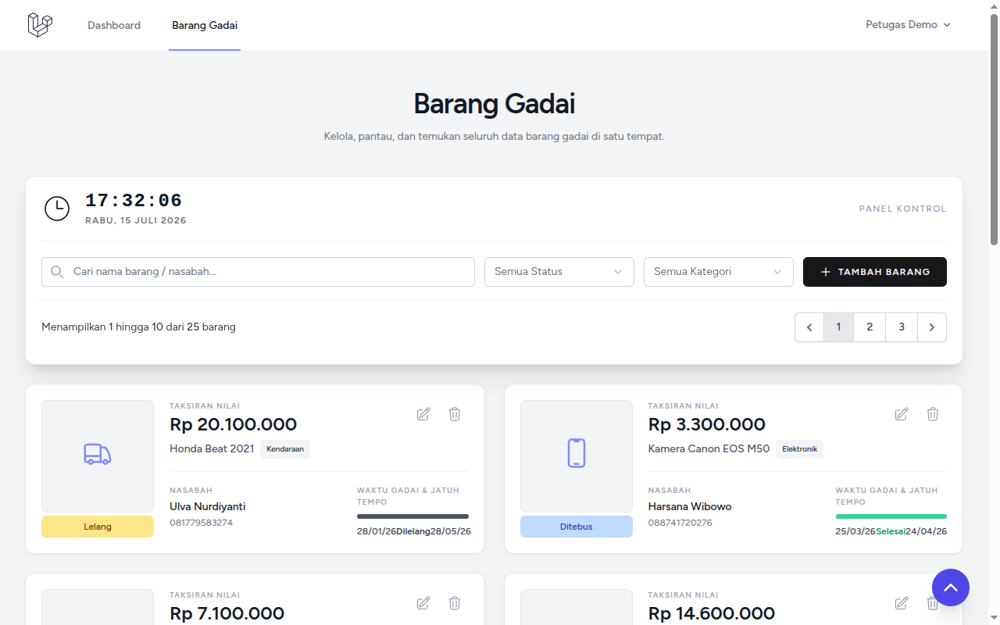
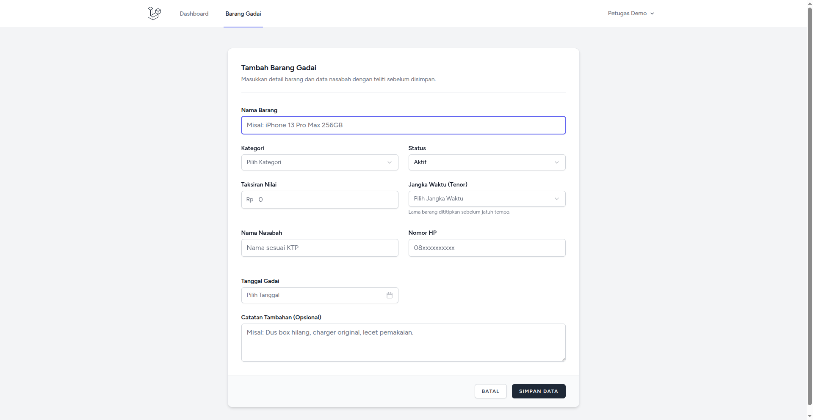

# SiGadai 📦

Aplikasi manajemen inventaris barang gadai yang dibangun sebagai portofolio bertema bisnis gadai syariah.


---

## 🚀 Live Demo & Akses

Aplikasi ini sudah di-deploy dan dapat dicoba secara langsung pada tautan berikut:

**👉 [https://sigadai.my.id](https://sigadai.my.id)**

Gunakan kredensial berikut untuk masuk sebagai petugas koperasi:
- **Email:** `demo@sigadai.my.id`
- **Password:** `sigadai123`

*(Catatan: Data demo akan di-reset secara otomatis setiap jam untuk mencegah vandalisme).*

---

## 📸 Tampilan Aplikasi

> *(Untuk diisi dengan screenshot)*


*Dashboard dengan ringkasan status dan aset.*


*Daftar barang gadai lengkap dengan pencarian dan filter.*


*Form untuk mencatat barang gadai baru.*

---

## 📹 Video Demo

> *(Untuk diisi dengan link video)*

👉 **[Tonton Video Demo SiGadai di Sini](https://youtube.com/...)**

---

## ✨ Fitur Utama

- **Dashboard Informatif:** Ringkasan jumlah barang aktif, jatuh tempo, serta distribusi status (Aktif, Ditebus, Lelang) dalam bentuk chart visual.
- **Manajemen Barang Gadai:** Sistem pencatatan barang (elektronik & kendaraan) yang intuitif.
- **Pencarian & Filter Cerdas:** Filter berdasarkan status, dan cari barang berdasarkan nama barang atau nasabah.
- **Sistem Jatuh Tempo Otomatis:** Perhitungan masa jatuh tempo barang yang tercatat pada sistem.
- **Desain Modern:** Menggunakan Tailwind CSS dipadu dengan komponen ala Shadcn UI, menghadirkan antarmuka pengguna yang bersih dan nyaman.

---

## 🛠 Tech Stack & Keputusan Teknis

- **Framework:** Laravel 11 (PHP 8.3)
- **Frontend:** Blade + Tailwind CSS (via Vite)
- **Database:** MySQL 8

**Mengapa menggunakan Laravel Breeze?**
Breeze (blade stack) memberikan titik awal autentikasi yang ringan dan stabil. Kami sengaja **menonaktifkan** fitur *register* dan *forgot password* karena aplikasi ini hanya diakses oleh petugas koperasi internal.

**Mengapa hanya menggunakan 1 Tabel?**
Untuk menjaga *scope* proyek tetap sederhana sesuai fungsi manajemen inventaris, data nasabah digabung sebagai kolom langsung ke dalam tabel `barang_gadai`. Tidak ada relasi tabel kompleks atau manajemen role bertingkat. Skema ini cukup untuk kebutuhan esensial pencatatan.

---

## ⚙️ CI/CD & Deployment

Aplikasi ini dideploy di VPS **Biznet Ubuntu 24.04** dengan Nginx.

Proses deployment berjalan **sepenuhnya otomatis** menggunakan **GitHub Actions**. 
Setiap kali ada _push_ ke branch `main`, robot CI/CD akan:
1. Terhubung secara aman ke VPS menggunakan SSH Keys (SSH Action).
2. Menarik kode terbaru (`git pull`).
3. Menginstal dependensi Composer & NPM (`composer install --no-dev`, `npm run build`).
4. Menjalankan migrasi database produksi (`php artisan migrate --force`).
5. Mengoptimalkan cache aplikasi.

Pendekatan ini membuktikan kemampuan dasar untuk *Linux Server Administration* dan pemahaman ekosistem DevOps.

---

## 💻 Cara Menjalankan Secara Lokal

Jika Anda ingin menjalankan proyek ini di mesin lokal, ikuti langkah berikut:

```bash
# 1. Clone repositori
git clone https://github.com/Deearss/sigadai.git
cd sigadai

# 2. Install dependensi PHP
composer install

# 3. Setup file environment
cp .env.example .env
php artisan key:generate

# 4. Migrasi dan isi data dummy (Database SQLite siap digunakan tanpa konfigurasi tambahan)
php artisan migrate:fresh --seed

# 5. Install dependensi frontend & compile aset
npm install
npm run build

# 6. Jalankan local server
php artisan serve
```

Aplikasi dapat diakses di `http://localhost:8000`. Gunakan kredensial demo (`demo@sigadai.my.id` / `sigadai123`) untuk login.
